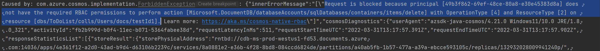

# Cosmos Spring sample app for testing AAD based access

Maven archetype to create a pre-configured maven project for Spring Boot Cosmos Application

Supports

* Cosmos Spring
* Azure Identity

## Where to configure cosmos details 

Open the application.properties file under resources and update all the attributes. The cosmos.add config would help you enabled the AAD based authentication

## Executing the application 

You can execute the application through an IDE and if you are using AAD based authentication and if the RBAC are not configured properly then you might encounter the following errors 

